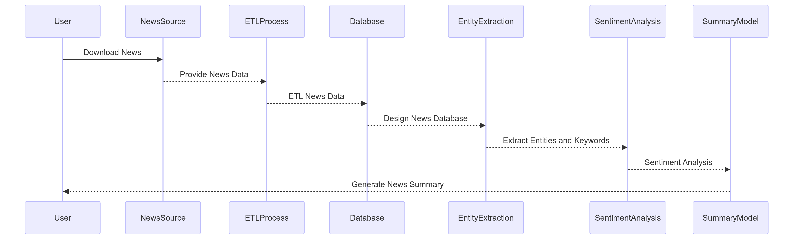

# Representative market rate analyzed in the trade-off between NLP and time series under edge computing

### Description
The objective of this project is to understand the behavior of the TRM based on the impact of news. Although this falls within the realm of economics, it will be approached from a time series perspective using NLP tools. Therefore, it will be an entirely empirical work, developed with edge computing. The development and deployment will include optimization factors that can be implemented on GPUs in terms of inference.

A special note about this development is that the entire process will be assisted by Coral AI, aiming to achieve optimization in response times during inference. Therefore, some development phases will be based on TensorFlow.


### Logic 




The workflow of the project begins with downloading news from various sources. Once obtained, the news undergoes an ETL (Extract, Transform, Load) process to clean and structure the data. These structured data are stored in a database specifically designed to handle news information. Next, entity and keyword extraction is performed from the stored news, allowing the identification of the most relevant elements of each article. Subsequently, sentiment analysis is conducted to determine the polarity of the news, that is, whether they are positive, negative, or neutral. Finally, a news summary model takes all this processed information and generates a concise and relevant summary for the user.


In the case of the dollar, the aim is to download its value twice a day: once in the morning and again in the evening, to evaluate its variation throughout the day. The goal is to store this value, along with the news, for at least 30 business days to build an empirical framework. This will allow us to start implementing a reinforcement learning improvement to the model, ultimately creating a final version that aims to closely approximate a more accurate TRM under these conditions.

### Technologies and Tools Used for This Project

- Raspberry Pi 5
- Coral USB Accelerator
- TensorFlow
- scikit-learn
- MLflow
- Docker
- FastApi

### Project Distribution

```

```


